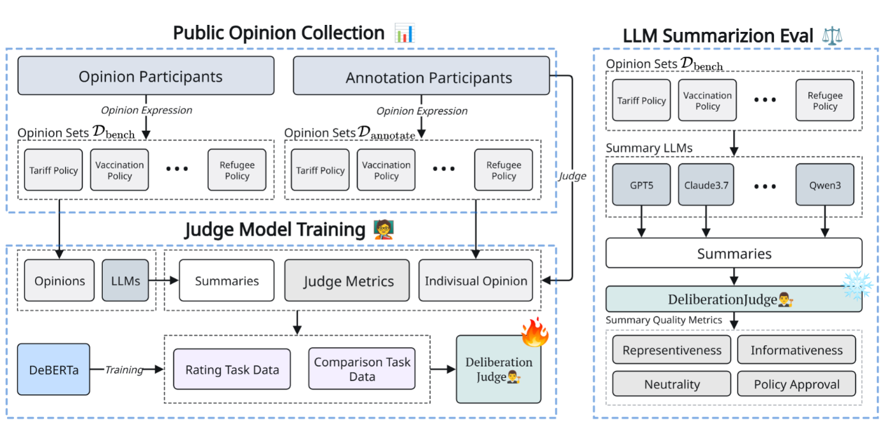
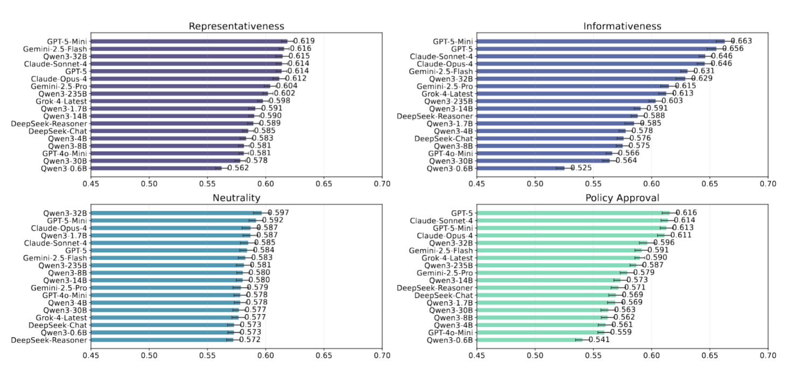

# Can AI Truly Represent Your Voice in Deliberations? A Comprehensive Study of Large-Scale Opinion Aggregation with LLMs
Scaling evaluation of LLM-based opinion summarization in public deliberation.

<div align=center>

</div>
<h2 align="center"> <a href="https://shuyhere.github.io/LLMs-for-Scalable-Deliberation/">	LLMs-for-Scalable-Deliberation </a></h2>

<h5 align="center"> 

If you like our project, please give us a star ⭐ on GitHub for the latest update.  </h2>

</h5>

<div align=center>
  
[](https://shuyhere.github.io/LLMs-for-Scalable-Deliberation/) 
[](https://shuyhere.github.io/LLMs-for-Scalable-Deliberation/)

This repository is the official code and data of ``Can AI Truly Represent Your Voice in Deliberations? A Comprehensive Study of Large-Scale Opinion Aggregation with LLMs''.
</div>

---

## 📣 News

*  Our code and data are released. 

## 🧐 Overview

<div align=center>

</div>

Public deliberations generate vast amounts of free-form input, yet producing summaries that are both informative and fair remains costly and difficult. Recent approaches attempt to harness LLMs to assist this process, offering efficiency gains but also raising concerns: they risk over-representing majority views and introducing bias, challenging the reliability of current practices. These issues motivate our central question:

```
Can LLMs truly support deliberation by producing summaries that are representative, informative, and neutral for policy use—and how can we evaluate them reliably at scale?
```
To tackle this challenge, we propose DeliberationBank, a large-scale dataset of diverse human opinions, together with DeliberationJudge, an automatic evaluation framework that integrates LLM-based and model-based judging for opinion summarization in deliberations.

## 🏆 Main Results

<div align=center>

</div>

## ⚙️ Data and Benchmarking your own models

We release the Deliberation dataset for 10 topics for evaluation, covering both binary policy questions and open-ended questions about societal issues.

### 📊 Dataset Format

The opinion dataset is located in `datasets/opinion_dataset/` and contains 10 JSON files:

**Binary Policy Questions:**
- `Binary-Health-Care-Policy.json`
- `Binary-Online-Identity-Policies.json` 
- `Binary-Refugee-Policies.json`
- `Binary-Tariff-Policy.json`
- `Binary-Vaccination-Policy.json`

**Open-ended Questions:**
- `Openqa-AI-changes-human-life.json`
- `Openqa-Influencers-as-a-job.json`
- `Openqa-Tipping-System.json`
- `Openqa-Trump-cutting-funding.json`
- `Openqa-Updates-of-electronic-products.json`

Each dataset file follows this JSON structure:
```json
{
  "question": "The main deliberation question (2-3 sentences expected)",
  "comments": [
    {
      "index": 0,
      "comment": "Individual participant opinion/response"
    },
    {
      "index": 1, 
      "comment": "Another participant opinion/response"
    }
    // ... more comments
  ]
}
```

## 🛠️ Environment Setup

This project uses [uv](https://docs.astral.sh/uv/) for fast and reliable Python package management.

### Prerequisites
- Python 3.12 or higher
- uv package manager

### Installation Steps

1. **Install uv** (if not already installed):
   ```bash
   curl -LsSf https://astral.sh/uv/install.sh | sh
   
   
   # Or via pip
   pip install uv
   ```

2. **Clone and setup the project**:
   ```bash
   git clone https://github.com/shuyhere/LLMs-for-Scalable-Deliberation.git
   cd LLMs-for-Scalable-Deliberation
   
   # Install dependencies and create virtual environment
   uv sync
   ```

3. **Activate the environment**:
   ```bash
   # uv automatically manages the virtual environment
   # Run scripts with: uv run <command>
   # Or activate manually: source .venv/bin/activate
   ```

4. **Environment Configuration**:
   Create a `.env` file from the `.env.example` file in the project root with your API keys:
   ```bash
   openai_base_url = ""
   openai_key = ""

   # Add other required API keys
   ```

## 🚀 SLURM Job Scripts Usage

The project includes three main SBATCH scripts for distributed computing on SLURM clusters:

### 1. `sbatch_gen.sh` - Summary Generation

**Purpose**: Submit parallel jobs to generate summaries using multiple LLMs across different datasets and sample sizes.

**Usage**:
```bash
# Basic usage with default settings
./scripts/sbatch_scripts/sbatch_gen.sh

# Specify models and datasets
./scripts/sbatch_scripts/sbatch_gen.sh -m gpt-4o-mini,gpt-5 -d all

# Custom sample sizes and output directory
./scripts/sbatch_scripts/sbatch_gen.sh -n 10,20,50 -o results/my_summaries

# Debug mode (small dataset, dry run)
./scripts/sbatch_scripts/sbatch_gen.sh --debug --dry-run
```

**Key Parameters**:
- `-m, --models`: Comma-separated model list or 'all'
- `-d, --datasets`: Dataset paths or 'all' 
- `-n, --num-samples`: Number of comments per dataset
- `-s, --sample-times`: Sampling iterations per model
- `-o, --output-dir`: Base output directory
- `--max-jobs`: Maximum parallel SLURM jobs
- `--time`: Job time limit (default: 12:00:00)
- `--memory`: Memory per job (default: 32G)
- `--skip-existing`: Skip if outputs exist
- `--missing-only`: Only submit jobs for missing data

**Available Models**: gpt-5, gpt-4o-mini, claude-sonnet-4, gemini-2.5-flash, deepseek-reasoner, qwen3 variants, and more.

### 2. `sbatch_eval.sh` - Summary Evaluation

**Purpose**: Evaluate generated summaries using different evaluation models with automated checkpoint support.

**Usage**:
```bash
# Evaluate all summaries with all evaluation models
./scripts/sbatch_scripts/sbatch_eval.sh

# Specific evaluation model for all summary models
./scripts/sbatch_scripts/sbatch_eval.sh gpt-4o-mini all all

# Evaluate specific summary model with specific evaluator
./scripts/sbatch_scripts/sbatch_eval.sh gpt-5-nano gpt-4o-mini protest

# Check job status
./scripts/sbatch_scripts/sbatch_eval.sh status
```

**Parameters**:
1. `[evaluation_model]`: Model to use for evaluation (default: "all")
2. `[summary_model]`: Which summary model to evaluate (default: "all")  
3. `[dataset]`: Dataset to evaluate on (default: "all")

**Available Evaluation Models**: gpt-4o-mini, gpt-5-nano, gemini-2.5-flash-lite, claude-sonnet variants

### 3. `sbatch_regression_eval.sh` - Regression Evaluation

**Purpose**: Perform regression-based evaluation using trained DeBERTa models for scalable assessment.

**Usage**:
```bash
# Evaluate all models with all sample sizes
./scripts/sbatch_scripts/sbatch_regression_eval.sh

# Specific models and sizes
./scripts/sbatch_scripts/sbatch_regression_eval.sh --models deepseek-chat,gpt-4o-mini --sizes 500,1000

# Custom evaluation model path
./scripts/sbatch_scripts/sbatch_regression_eval.sh --eval-model-path /path/to/model
```

**Parameters**:
- `--eval-model-path`: Path to trained DeBERTa model
- `--models`: Comma-separated model list to evaluate
- `--sizes`: Sample sizes for evaluation (default: 500, 1000)

**Output**: Results saved to `results/regression_evaluation_scaled/{model}/{size}/`

### 🔧 Job Management

**Monitor Jobs**:
```bash
squeue -u $USER                    # Check all your jobs
squeue -u $USER --name="SUMMARY_*" # Check generation jobs
scancel <job_id>                   # Cancel specific job
scancel -u $USER                   # Cancel all your jobs
```

**Resume Interrupted Evaluations**:
```bash
# Evaluation jobs automatically save checkpoints
uv run scripts/batch_evaluate_summaries.py --checkpoint evalsum_logs/evaluation_checkpoint_<model>_<dataset>.json --resume
``` 
